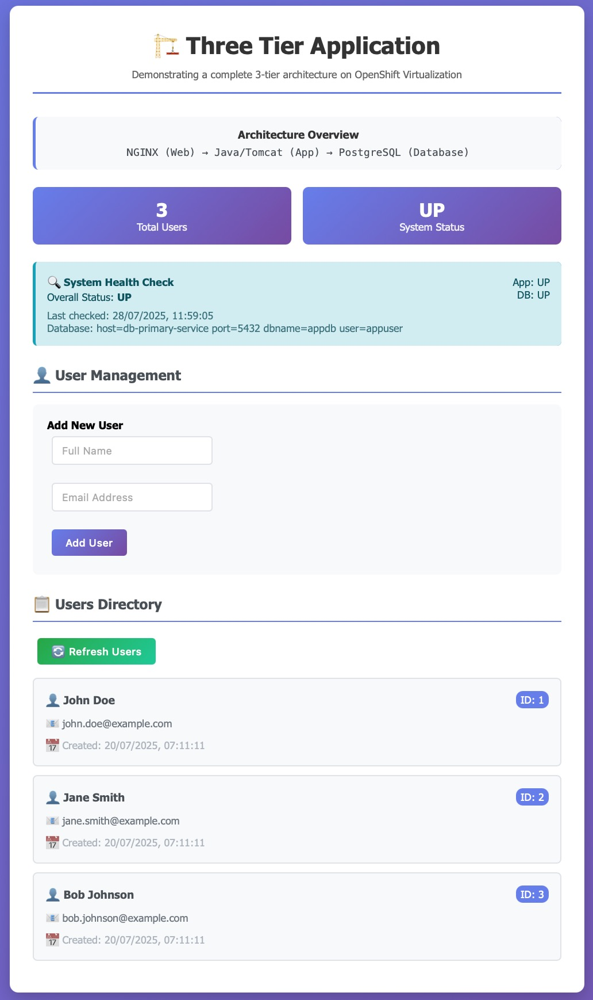

# Three-Tier Java Web Application

## Project Overview

This repository contains a Java web application that demonstrates a complete three-tier architecture pattern. The application is specifically designed for deployment on IBM Cloud Red Hat OpenShift Kubernetes Service (ROKS) with OpenShift Virtualization. See [ocp-v-3-tier-app](https://github.com/neil1taylor/ocp-v-3-tier-app)

The application implements a user management system with a responsive web interface, RESTful API endpoints, and PostgreSQL database integration. It showcases the separation of concerns across the three tiers while providing a practical example of enterprise application architecture.



### Purpose

This project serves several purposes:

1. **Educational Resource**: Demonstrates implementing a three-tier architecture in Java
2. **Reference Implementation**: Provides a template for building scalable web applications
3. **Deployment Example**: Can be used as a multi-tier application on OpenShift Virtualization

## Three-Tier Architecture

This application implements the classic three-tier architecture pattern, which separates the application into three logical and physical computing tiers:

### Architecture Overview

```
Client Browser → Web Tier (NGINX) → Application Tier (Tomcat/Java) → Database Tier (PostgreSQL)
```

The application is structured into three distinct tiers:

1. **Web Tier (Presentation Layer)**
   - **Technology**: NGINX web server
   - **Purpose**: Serves static content, handles HTTP requests, and forwards dynamic requests to the application tier
   - **Components**: HTML, CSS, JavaScript files
   - **Responsibilities**: User interface rendering, client-side validation, AJAX requests to the API

2. **Application Tier (Business Logic Layer)**
   - **Technology**: Apache Tomcat with Java Servlets
   - **Purpose**: Processes business logic, handles API requests, and manages communication with the database tier
   - **Components**: Java servlets, business logic classes, data models
   - **Responsibilities**: Request processing, data validation, business rule enforcement, transaction management

3. **Database Tier (Data Access Layer)**
   - **Technology**: PostgreSQL database
   - **Purpose**: Stores and manages application data
   - **Components**: Database tables, indexes, constraints
   - **Responsibilities**: Data storage, data integrity, query processing

This GitHub repository focus is on the Application Tier. The web and database tiers are installed and configured via cloud-init in [ocp-v-3-tier-app](https://github.com/neil1taylor/ocp-v-3-tier-app).

### Benefits of Three-Tier Architecture

- **Separation of Concerns**: Each tier has a specific responsibility, making the codebase more maintainable
- **Scalability**: Each tier can be scaled independently based on specific requirements
- **Security**: Sensitive operations and data can be isolated in the appropriate tier
- **Flexibility**: Components within each tier can be modified or replaced without affecting other tiers
- **Performance**: Optimizations can be applied to specific tiers as needed

## Core Technologies

### Java
Java is a general-purpose, class-based, object-oriented programming language designed to have as few implementation dependencies as possible. It is a computing platform for application development that was first released by Sun Microsystems in 1995 and later acquired by Oracle Corporation.

Key characteristics of Java include:
- **Platform Independence**: Java follows the "write once, run anywhere" (WORA) principle, allowing code to run on any device with a Java Virtual Machine (JVM), regardless of the underlying hardware and operating system.
- **Object-Oriented**: Java's object-oriented nature encourages modular and reusable code through concepts like encapsulation, inheritance, and polymorphism.
- **Robust and Secure**: Java provides automatic memory management, strong type checking, and exception handling, making applications more robust and secure.

In this three-tier application, Java serves as the foundation for the application tier, powering the business logic through servlets that process requests, implement business rules, and coordinate communication between the presentation and data tiers.

### Maven
Maven is a powerful build automation and dependency management tool primarily used for Java projects. Developed by the Apache Software Foundation, Maven addresses two critical aspects of software development: how software is built and how dependencies are managed.

Key features of Maven include:
- **Dependency Management**: Maven automatically downloads and manages Java libraries and plugins required by the project, ensuring version compatibility.
- **Standardized Build Lifecycle**: Maven defines a standard build lifecycle that includes phases like compile, test, package, install, and deploy.
- **Project Object Model (POM)**: Projects are configured using a pom.xml file that defines project dependencies, build plugins, goals, and other settings.

In this project, Maven manages all dependencies (such as servlet APIs, PostgreSQL drivers, and JSON libraries), standardizes the build process, and packages the application as a WAR file ready for deployment to Tomcat.

### Apache Tomcat
Apache Tomcat is an open-source web server and servlet container developed by the Apache Software Foundation. It implements the Java Servlet, JavaServer Pages (JSP), WebSocket, and Java Expression Language specifications, providing a "pure Java" HTTP web server environment for Java code to run.

Key aspects of Tomcat include:
- **Servlet Container**: Tomcat provides a runtime environment for Java servlets, managing their lifecycle and providing access to the HTTP request/response objects.
- **Web Server Capabilities**: While primarily a servlet container, Tomcat also functions as a web server capable of serving static content.
- **Lightweight and Configurable**: Compared to full Java EE application servers, Tomcat is lightweight and easily configurable, making it ideal for a wide range of applications.

In this three-tier application, Tomcat serves as the application server in the middle tier, hosting the Java servlets that process business logic and API requests. It manages HTTP connections, routes requests to the appropriate servlets, and handles the servlet lifecycle, allowing the application to focus on implementing business functionality rather than low-level HTTP processing.

## File Analysis

This section provides a comprehensive description of each file in the project and its purpose within the three-tier architecture.

### Project Configuration Files

#### pom.xml
- **Purpose**: Maven Project Object Model file that defines project configuration, dependencies, and build settings
- **Role**: Cross-tier configuration that affects all layers of the application
- **Key Features**:
  - Specifies dependencies for all tiers (servlet API, PostgreSQL, Gson, logging)
  - Configures the build process and packaging format (WAR)
  - Defines project metadata and version information

#### .gitignore
- **Purpose**: Specifies files and directories to be excluded from version control
- **Role**: Development utility that spans all tiers
- **Key Features**:
  - Prevents build artifacts, IDE files, logs, and environment-specific configurations from being committed
  - Ensures clean repository structure and prevents sensitive information from being shared

### Build and Deployment Scripts

#### scripts/build.sh
- **Purpose**: Automates the build process using Maven
- **Role**: Development/deployment utility that spans all tiers
- **Key Features**:
  - Sets up Java environment (Java 17)
  - Configures Maven options
  - Builds the application using Maven
  - Verifies the build output (WAR file)

#### scripts/deploy.sh
- **Purpose**: Automates the deployment process to Apache Tomcat
- **Role**: Deployment utility primarily for the application tier
- **Key Features**:
  - Sets up Java environment
  - Installs and configures Apache Tomcat
  - Creates a systemd service for Tomcat
  - Configures SELinux and firewall settings
  - Deploys the WAR file to Tomcat
  - Starts the Tomcat service and verifies the deployment

#### scripts/verify-setup.sh
- **Purpose**: Verifies the repository structure and required files
- **Role**: Development utility that spans all tiers
- **Key Features**:
  - Checks directory structure
  - Verifies presence of required files
  - Validates script permissions
  - Ensures proper setup before building or deploying

### Presentation Tier Components

#### src/main/webapp/index.html
- **Purpose**: Main entry point for the web application
- **Role**: Presentation tier component that provides the user interface
- **Key Features**:
  - Responsive user interface with CSS styling
  - User management form for adding new users
  - Users directory for displaying existing users
  - Health status display
  - JavaScript functions for API interaction and UI updates
  - Makes AJAX requests to UserServlet and HealthServlet

#### src/main/webapp/WEB-INF/web.xml
- **Purpose**: Java web application deployment descriptor
- **Role**: Configuration file for the presentation and application tiers
- **Key Features**:
  - Servlet definitions and mappings
  - Welcome file configuration
  - Error page definitions
  - Security constraints for API endpoints
  - Maps servlet classes to URL patterns
  - Configures servlet initialization parameters

### Application Tier Components

#### src/main/java/com/threetier/webapp/UserServlet.java
- **Purpose**: REST API servlet for user management
- **Role**: Application tier component that handles user-related API requests
- **Key Features**:
  - Handles GET requests to retrieve all users
  - Processes POST requests to create new users
  - Initializes database schema on startup
  - Error handling and JSON response formatting
  - Uses DatabaseConnection for database operations
  - Uses User class for data representation and validation

#### src/main/java/com/threetier/webapp/HealthServlet.java
- **Purpose**: Health check servlet for monitoring application and database status
- **Role**: Application tier component that provides system health information
- **Key Features**:
  - Checks application status
  - Tests database connectivity using DatabaseConnection
  - Returns detailed health status in JSON format
  - Sets appropriate HTTP status codes
  - Provides real-time health information about the application

#### src/main/java/com/threetier/webapp/User.java
- **Purpose**: Model class representing a user entity
- **Role**: Application tier component that defines the data model
- **Key Features**:
  - User attributes (id, name, email, timestamps)
  - Data validation methods
  - Object comparison and string representation utilities
  - Used by UserServlet to validate and represent user data

### Data Tier Components

#### src/main/java/com/threetier/webapp/DatabaseConnection.java
- **Purpose**: Utility class for managing PostgreSQL database connections
- **Role**: Data tier component responsible for database connectivity
- **Key Features**:
  - Configurable database connection parameters via environment variables
  - Database schema initialization with users table
  - Connection testing functionality
  - Debugging information retrieval
  - Used by UserServlet and HealthServlet to establish database connections

### Database Structure

The database tier uses PostgreSQL and consists of:

- **Users Table**:
  - `id`: Primary key, auto-incrementing
  - `name`: User's full name
  - `email`: User's email address (unique)
  - `created_at`: Timestamp of user creation
  - `updated_at`: Timestamp of last update

- **Indexes**:
  - Email index for faster lookups

## Component Interactions

### Data Flow

1. **Client to Web Tier**:
   - User interacts with the web interface
   - Browser sends HTTP requests to the server
   - JavaScript handles form submissions and UI updates

2. **Web Tier to Application Tier**:
   - AJAX requests are sent to the application's REST API endpoints
   - API requests are processed by the appropriate servlet

3. **Application Tier to Database Tier**:
   - Servlets use the DatabaseConnection utility to interact with the database
   - SQL queries are executed to retrieve or modify data
   - Results are processed and transformed into Java objects

4. **Response Path**:
   - Database returns query results to the application tier
   - Application tier formats the data (typically as JSON)
   - Web tier receives the response and updates the UI accordingly

### API Endpoints

- **`GET /api/users/`**
  - **Purpose**: Retrieve a list of all users
  - **Response**: JSON array of user objects
  - **Implementation**: `UserServlet.doGet()`

- **`POST /api/users/`**
  - **Purpose**: Create a new user
  - **Parameters**: `name` (string), `email` (string)
  - **Response**: JSON object of the created user
  - **Implementation**: `UserServlet.doPost()`

- **`GET /health` or `GET /api/system-health`**
  - **Purpose**: Check system health status
  - **Response**: JSON object with application and database status
  - **Implementation**: `HealthServlet.doGet()`

## Setup and Installation

### Prerequisites

- Java 11 or higher (Java 17 recommended)
- Maven 3.6+
- PostgreSQL database
- Apache Tomcat 9.x (for local deployment)
- NGINX (for production deployment)

### Environment Setup

1. **Clone the repository**:
   ```bash
   git clone https://github.com/yourusername/three-tier-java-app.git
   cd three-tier-java-app
   ```

2. **Verify the setup**:
   ```bash
   chmod +x scripts/verify-setup.sh
   ./scripts/verify-setup.sh
   ```

3. **Configure database connection**:
   
   Set the following environment variables to configure the database connection:
   ```bash
   export DB_HOST=localhost
   export DB_PORT=5432
   export DB_NAME=appdb
   export DB_USER=appuser
   export DB_PASSWORD=apppassword
   ```

   Alternatively, the application will use default values if these are not set.

4. **Create PostgreSQL database**:
   ```bash
   sudo -u postgres psql
   CREATE DATABASE appdb;
   CREATE USER appuser WITH ENCRYPTED PASSWORD 'apppassword';
   GRANT ALL PRIVILEGES ON DATABASE appdb TO appuser;
   \q
   ```

## Build and Deployment

### Build Process

The application uses Maven for building and packaging. The build process is automated through the `build.sh` script:

1. **Make the build script executable**:
   ```bash
   chmod +x scripts/build.sh
   ```

2. **Run the build script**:
   ```bash
   ./scripts/build.sh
   ```

The build script performs the following actions:
- Sets up the Java environment (Java 17)
- Configures Maven options
- Builds the application using Maven
- Verifies the build output (WAR file)

### Deployment Process

The deployment process is automated through the `deploy.sh` script:

1. **Make the deployment script executable**:
   ```bash
   chmod +x scripts/deploy.sh
   ```

2. **Run the deployment script**:
   ```bash
   ./scripts/deploy.sh
   ```

The deployment script performs the following actions:
- Sets up the Java environment
- Installs and configures Apache Tomcat
- Creates a systemd service for Tomcat
- Configures SELinux and firewall settings
- Deploys the WAR file to Tomcat
- Starts the Tomcat service
- Verifies the deployment

### Deployment to OpenShift

The app has been designed to be built and deployed via a deployment to IBM Cloud ROKS with OpenShift Virtualization. See the [ocp-v-3-tier-app](https://github.com/neil1taylor/ocp-v-3-tier-app) GutHub repository.

## Environment Variables

The application uses the following environment variables for configuration:

| Variable | Description | Default Value |
|----------|-------------|---------------|
| `DB_HOST` | Database host | `db-primary-service` |
| `DB_PORT` | Database port | `5432` |
| `DB_NAME` | Database name | `appdb` |
| `DB_USER` | Database user | `appuser` |
| `DB_PASSWORD` | Database password | `apppassword` |

## Troubleshooting

### Common Issues

1. **Database Connection Failures**:
   - Verify that the PostgreSQL service is running
   - Check the database credentials in environment variables
   - Ensure network connectivity to the database host

2. **Application Deployment Issues**:
   - Check Tomcat logs: `tail -f /opt/tomcat/logs/catalina.out`
   - Verify the WAR file was built correctly
   - Ensure proper permissions on Tomcat directories

3. **Web Interface Not Loading**:
   - Check browser console for JavaScript errors
   - Verify that the application tier is responding to API requests
   - Check NGINX configuration and logs

### Health Check

The application provides a health check endpoint at `/health` or `/api/system-health` that can be used to diagnose issues:

```bash
curl http://localhost:8080/health
```

The response includes:
- Overall system status
- Application status
- Database connection status
- Database connection details

## Features

- RESTful API for user management
- Real-time health monitoring
- Database connectivity with PostgreSQL
- Responsive web interface
- Automatic error handling
- Cross-tier communication demonstration

## Repository Structure

```
three-tier-java-app/
├── README.md                                     # Project documentation
├── pom.xml                                       # Maven project configuration
├── .gitignore                                    # Git ignore file
├── 3-tier-app.jpg                                # Architecture diagram
├── LICENSE                                       # MIT License file
├── scripts/                                      # Build and deployment scripts
│   ├── build.sh                                  # Automated build script
│   ├── deploy.sh                                 # Automated deployment script
│   └── verify-setup.sh                           # Repository verification script
└── src/                                          # Source code
    └── main/
        ├── java/com/threetier/webapp/            # Java application code
        │   ├── DatabaseConnection.java           # Database connectivity (Data Tier)
        │   ├── User.java                         # User model (Application Tier)
        │   ├── UserServlet.java                  # User API endpoint (Application Tier)
        │   └── HealthServlet.java                # Health check endpoint (Application Tier)
        └── webapp/                               # Web application resources
            ├── index.html                        # Main web interface (Presentation Tier)
            └── WEB-INF/web.xml                   # Web application configuration
```

## License

This project is licensed under the MIT License - see the LICENSE file for details.
